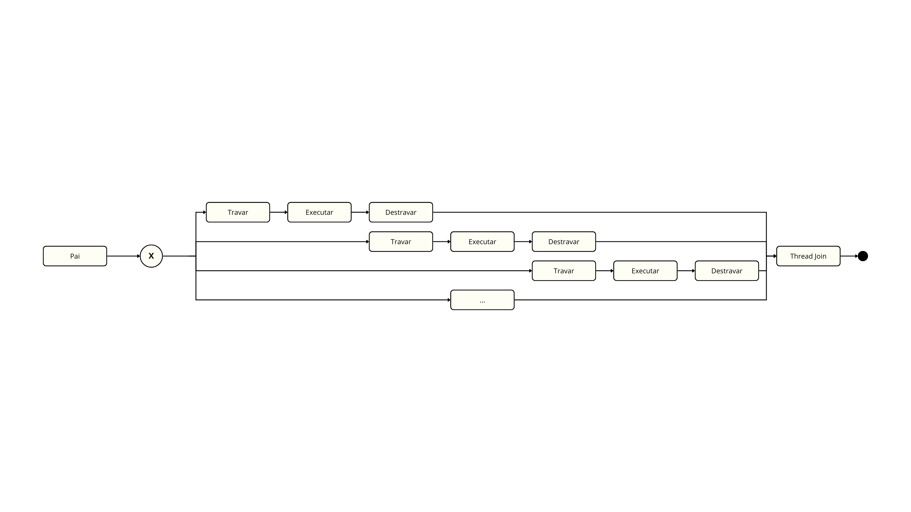
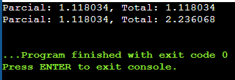
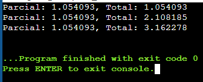
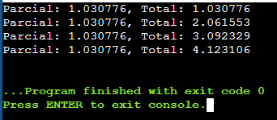

# Questão 01)

(★★★) Corrija o programa “fibonacci-sum.c”, que implementa uma versão multithread
da soma de Fibonacci.

# Questão 02)

(★★★) Uma colônia de N formiguinhas deve completar o caminho desde seu alimento
(START) até casa (END) andando pelas faces de um paralelepípedo de lado “a”. Se sabe
que as formiguinhas são animais cooperativos e muito inteligentes. Elas dividem o
esforço, trabalhando apenas uma parte do caminho de forma equitativa e pegando
sempre a rota do caminho mais curto até a meta. As formiguinhas não gostam de andar
pelas arestas

**Resposta:**

Imaginando que todos os paralelepípedos possuem apenas ângulos retos, ou seja, que sejam cubos, podemos visualizar uma decomposição tridimensional em um plano. Nesse caso, a menor distância entre START e END será uma linha reta no plano “desdobrado”.

Cada formiguinha percorrerá exatamente uma face do polígono e todas percorrerão o mesmo comprimento de percurso. Dessa forma, o script foi desenvolvido seguindo a lógica:

1. Calcular a direção do trajeto (ângulo) a partir de START até END.

2. Criar threads, cada uma simulando o caminhar de uma formiguinha.

3. Cada formiguinha calcula o trajeto (hipotenusa) percorrido em sua face, a partir do ângulo (direção na qual ela esta andando) e o lado de tamanho 'a', e adiciona à soma total.

Os resultados mostram que o algoritmo é genérico e pode ser executado para diferentes valores de N. É possível observar que, quanto maior o N, mais próxima a distância percorrida por cada formiguinha se aproxima do comprimento 'a'.

# Questão 03)

(★★★★) Proponha o programa de comunicação “cc-eh-O-curso.c” usando pipes, onde
um processo pai se comunica com seus três filhos mostrando na tela, no acionamento de
um sinal ingressado via teclado, seu PID e os de cada filho. Discuta a sua solução no arquivo README.md.

**Requisito**: A função sinal deve ser o mais leve possível, isto é, quando chamada, ela
não deve travar a execução da main.

**Resposta:**

Um script foi desenvolvido seguindo a seguinte lógica de execução:

1. O processo pai criou todos os processos filhos.
2. Os processos filhos enviam pelo pipe os PIDs.
3. O processo pai cria uma tratador para o sinal de SIGINT.
4. O processo pai entra em loop para `flag = 0`.
5. Quando o sinal SIGINT é escutado o processo pai escuta pelo pipe os PIDs de cada filho.
6. O processo pai imprime os PIDs dos filhos e termina a execução.